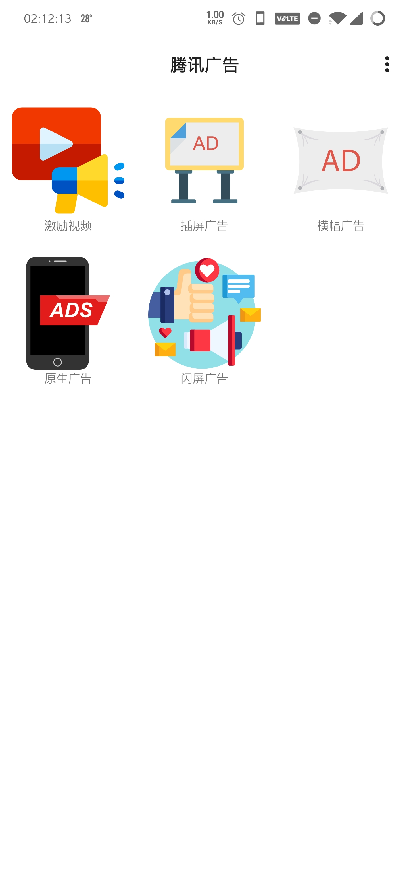
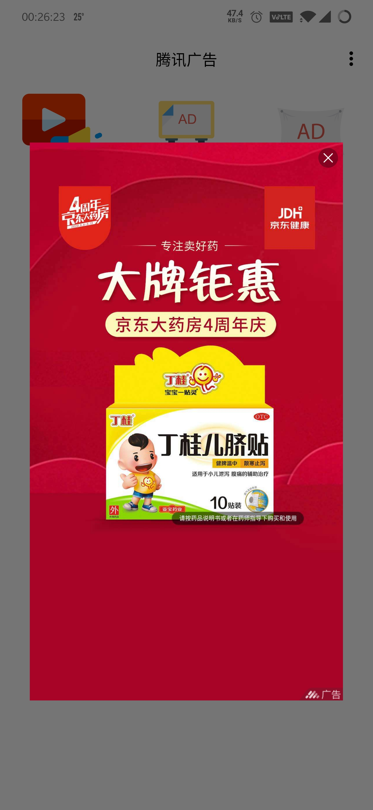
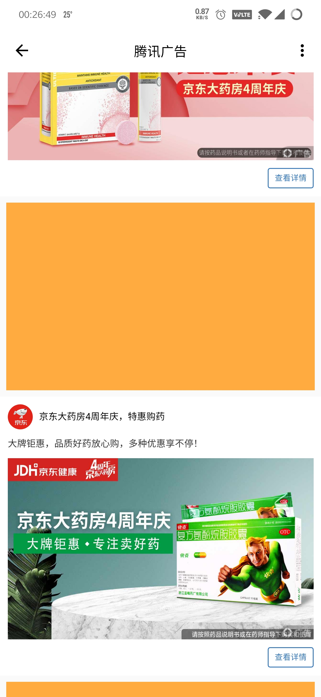
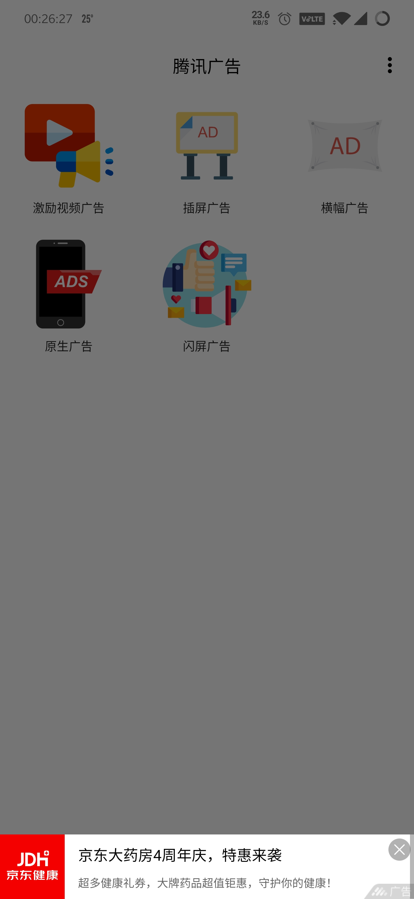

# TencentAD
[](https://pub.dartlang.org/packages/admob_flutter)
[](https://github.com/Mr-Cai/tencent_ad)
[](https://github.com/Mr-Cai/tencent_ad)
[](https://github.com/Mr-Cai/tencent_ad)
[](https://twitter.com/TwCai)

腾讯广告优量汇插件

### 支持平台
- Android
- IOS <待开发>

### 支持腾讯广告特性
- 闪屏广告
- 横幅广告
- 插屏广告
- 激励视频
- 原生模板
- 原生自渲染<正在开发>

### 截图








# 安装

1. 添加插件包在pubspec.yaml文件:

```dart
dependencies:
  tencent_ad: ^1.0.1
```

2. 获取插件源码, 运行命令:

```dart
$ flutter pub get
```

3. 使用示例:

- 配置ID&导入包
```dart
import 'package:tencent_ad/tencent_ad.dart';

Map<String, String> get configID {
  switch (defaultTargetPlatform) {
    case TargetPlatform.android:
      return {
        'appID': '你的ID',
        'splashID': '你的ID',
        'bannerID': '你的ID',
        'intersID': '你的ID',
        'rewardID': '你的ID',
        'nativeDIYID': '你的ID',
        'nativeID': '你的ID',
      };
      break;
    case TargetPlatform.iOS:
      return {
        'appID': '你的ID',
        'splashID': '你的ID',
        'bannerID': '你的ID',
        'intersID': '你的ID',
        'rewardID': '你的ID',
        'nativeID': '你的ID',
      };
      break;
    default:
      return {'': ''};
  }
}
```

- 闪屏广告
```dart
TencentADPlugin.config(appID: '你的媒体ID').then(
      (_) => SplashAD(
          posID: configID['splashID'],
          callBack: (event, args) {
            switch (event) {
              case SplashADEvent.onNoAD:
              case SplashADEvent.onADDismissed:
                // 实现回调逻辑
                break;
              default:
            }
          }).showAD(),
```
  
- 横幅广告
```dart
  Widget _buildBanner() {
    final _adKey = GlobalKey<BannerADState>();
    final size = MediaQuery.of(context).size;
    return BannerAD(
      posID: configID['bannerID'],
      key: _adKey,
      callBack: (event, args) {
        switch (event) {
          case BannerEvent.onADClosed:
          case BannerEvent.onADCloseOverlay:
            showMenu(
              context: context,
              position: RelativeRect.fromLTRB(1.0, size.height * .82, 0.0, 0.0),
              items: [
                PopupMenuItem(
                  child: Text('刷新'),
                  value: 0,
                ),
                PopupMenuItem(
                  child: Text('关闭'),
                  value: 1,
                ),
              ],
            ).then((value) {
              switch (value) {
                case 0:
                  _adKey.currentState.loadAD();
                  break;
                case 1:
                  _adKey.currentState.closeAD();
                  Navigator.pop(context);
                  break;
                default:
              }
            });
            break;
          default:
        }
      },
      refresh: true,
    );
  }
```
  
- 插屏广告
```dart

showDialog(
    context: context,
    barrierDismissible: false,
    builder: (context) => IntersADWidget(
      configID['intersID'],
    ),
);

class IntersADWidget extends StatefulWidget {
  final String posID;

  IntersADWidget(this.posID);

  @override
  State<StatefulWidget> createState() => IntersADWidgetState();
}

class IntersADWidgetState extends State<IntersADWidget> {
  IntersAD intersAD;

  @override
  void initState() {
    super.initState();
    intersAD = IntersAD(posID: widget.posID, adEventCallback: _adEventCallback);
    intersAD.loadAD();
  }

  @override
  Widget build(BuildContext context) => Container();

  void _adEventCallback(IntersADEvent event, Map params) {
    switch (event) {
      case IntersADEvent.onADReceived:
        intersAD.showAD();
        break;
      case IntersADEvent.onADClosed:
        Navigator.of(context).pop();
        break;
      default:
    }
  }
}

```

- 激励视频
```dart
showDialog(
  context: context,
  barrierDismissible: false,
  builder: (context) => RewardADWidget(
  configID['rewardID'],
  ),
);

class RewardADWidget extends StatefulWidget {
  final String posID;

  RewardADWidget(this.posID);

  @override
  State<StatefulWidget> createState() => RewardADWidgetState();
}

class RewardADWidgetState extends State<RewardADWidget> {
  RewardAD rewardAD;
  num money = 0.00;

  @override
  void initState() {
    super.initState();
    rewardAD = RewardAD(posID: widget.posID, adEventCallback: _adEventCallback);
    rewardAD.loadAD();
    money = Random().nextDouble() + Random().nextInt(100);
  }

  @override
  Widget build(BuildContext context) => Container();

  void _adEventCallback(RewardADEvent event, Map params) {
    switch (event) {
      case RewardADEvent.onADLoad:
        rewardAD.showAD();
        break;
      case RewardADEvent.onADClose:
      case RewardADEvent.onVideoComplete:
        Navigator.of(context).pop();
        showDialog(
            context: context,
            builder: (context) {
              return Center(
                child: ClipRRect(
                  clipBehavior: Clip.antiAliasWithSaveLayer,
                  borderRadius: BorderRadius.circular(32.0),
                  child: Card(
                    child: Container(
                      width: 320.0,
                      height: 280.0,
                      color: Colors.red,
                      alignment: Alignment.center,
                      child: Text(
                        '恭喜你获得${money.toStringAsFixed(2)}元',
                        textScaleFactor: 2.1,
                      ),
                    ),
                  ),
                ),
              );
            });
        break;
      default:
    }
  }
}

```

- 原生模板
```dart
NativeAD(
  key: _adKey,
  posID: configID['nativeID'],
  adEventCallback: (event, args) {
    if (event == NativeADEvent.onLayoutChange && mounted) {
       setState(() {
     // 根据选择的广告位模板尺寸计算，这里是1280x720
        adHeight = MediaQuery.of(context).size.width *
        args['height'] / args['width'];
        });
      return;
    }
    if (event == NativeADEvent.onADClosed) {
       setState(() {
          adRemoved = true;
        });
       }
    },
    refreshOnCreate: true,
    requestCount: 1,
),
```